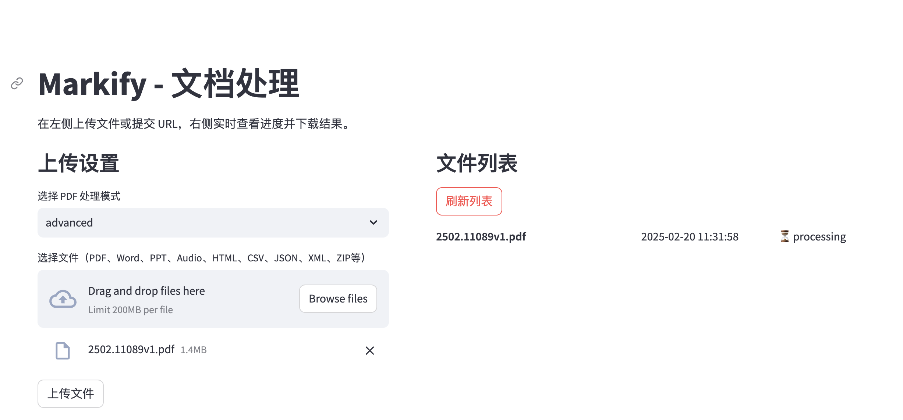
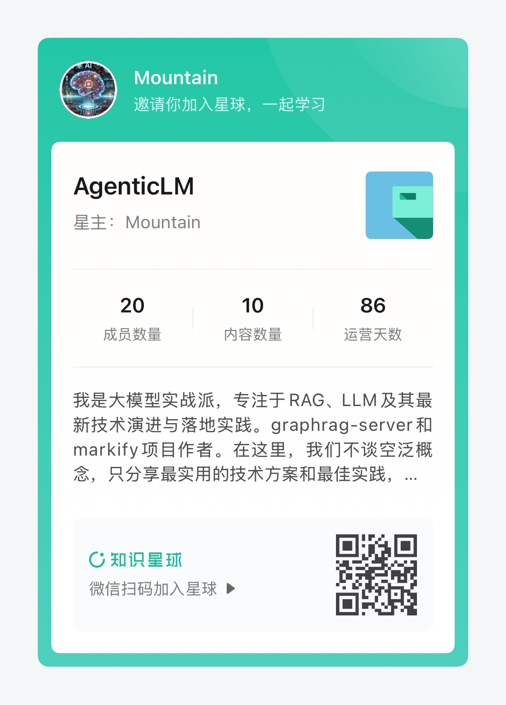

# Markify

✨ **轻松转换文件为 Markdown，助力 RAG 与 LLM 更智能地理解内容！** ✨  

🚀 **基于 Markitdown 与 MinerU**，支持多种格式转换，并提供 **高质量 PDF 解析**，让你的文档更易处理、更易用！  

📡 **支持 API & Streamlit 端**，随时随地高效转换，轻松集成！  

📂 **支持多种文件格式**：
- 📄 **文档**：PDF、Word、PPT、Excel  
- 🖼 **多媒体**：图片、音频  
- 🌐 **网页与数据**：HTML、CSV、JSON、XML  
- 🗂 **压缩文件**：ZIP  

⚡ **多种 PDF 解析模式，满足不同需求**：
- 🚀 **快速模式**（基于 pdfminer，解析高效）  
- 🏆 **高级模式**（结合 MinerU 深度解析，效果更佳）  
- ☁️ **云端模式**（开发中，敬请期待！）  

📖 **Markdown 化你的文件，助力 LLM 更好地理解与处理文档！** 💡


```shell
streamlit run ./client/streamlit_client.py
```

## API
FastAPI自带API文档 http://127.0.0.1:20926/docs
### 上传文件，创建任务
请求
```shell
curl -X 'POST' \
  'http://127.0.0.1:20926/api/jobs' \
  -H 'accept: application/json' \
  -H 'Content-Type: multipart/form-data' \
  -F 'file=@CoA.pdf;type=application/pdf' \
  -F 'mode=advanced'
```
响应
```json
{
  "job_id": "29bbad6b-c167-41f0-8a29-99551c499263"
}
```
### 查询任务状态
请求
```shell
curl -X 'GET' \
  'http://127.0.0.1:20926/api/jobs/29bbad6b-c167-41f0-8a29-99551c499263' \
  -H 'accept: application/json'
```
响应
```json
{
  "job_id": "29bbad6b-c167-41f0-8a29-99551c499263",
  "status": "completed",
  "filename": "CoA.pdf",
  "params": {
    "mode": "advanced"
  },
  "error": null
}
```
### 下载markdown文件
请求
```shell
curl -X 'GET' \
  'http://127.0.0.1:20926/api/jobs/29bbad6b-c167-41f0-8a29-99551c499263/result' \
  -H 'accept: application/json'
```
响应
文件


## Docker部署
```shell
docker pull wsjcuhk/markify:0.0.1
docker run -d -p 20926:20926 wsjcuhk/markify:0.0.1
```


## TODO
- 添加云端解析模式
- 自动打包为Docker镜像

## 赞助我
开源不易，请我喝杯咖啡！

有专业指导需求，可以加入我的知识星球，我会提供专业的技术指导。



## 致敬
本项目参考微软markitdown和上海浦语mineru。
- [markitdown](https://github.com/microsoft/markitdown)
- [mineru](https://github.com/opendatalab/MinerU)
